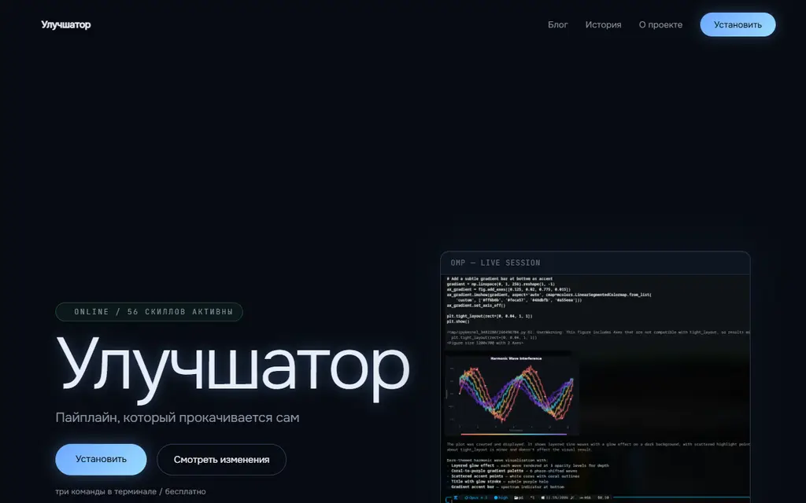
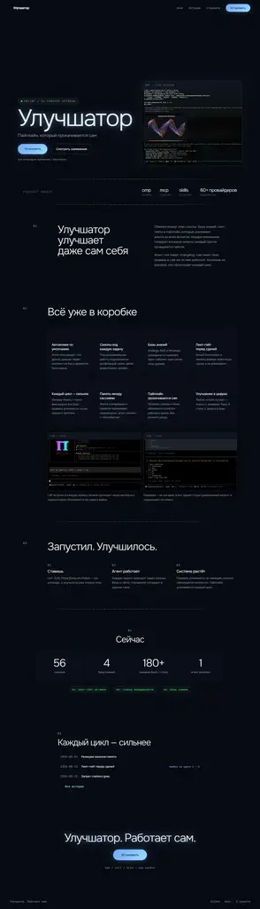

# Улучшатор — сайт

Витрина + личный блог улучшатора: обвязки вокруг Oh My Pi, которая
усиливает агента (скиллы, базы знаний, пайплайн, линт-гейты).

Тёмный дизайн с голубым свечением, контент в MDX, чистый статик.

## Скриншоты

### Главная — hero



### Главная — полностью



## Стек

- Next.js (App Router), статический экспорт (`output: "export"`)
- Контент: MDX в `content/changelog/` и `content/blog/`
- Шрифты: Onest / JetBrains Mono (next/font)
- Иконки и медиа: `public/icons/` (SVG), `public/shots/` (скриншоты omp)
- Тесты: vitest (`test/lib/content.test.ts`)
- Деплой: GitHub Actions → Pages (`deploy.yml`)

## Локально

```bash
npm install
npm run dev      # dev-сервер
npm run build    # статический экспорт в out/
npm test         # vitest
```

## Публикация

Записи — коммиты: `content/changelog/2026-08-24-<slug>.mdx`, пуш в main,
деплой сам. Правило для агента — в `AGENTS.md`.

При подключении собственного домена: указать Custom domain в настройках
Pages репозитория и убрать `NEXT_PUBLIC_BASE_PATH` из `deploy.yml`.

Дизайн-спек: `D:/WorkFlow/docs/superpowers/specs/2026-08-24-uluchshator-site-design.md`
План: `D:/WorkFlow/docs/superpowers/plans/2026-08-24-uluchshator-site.md`